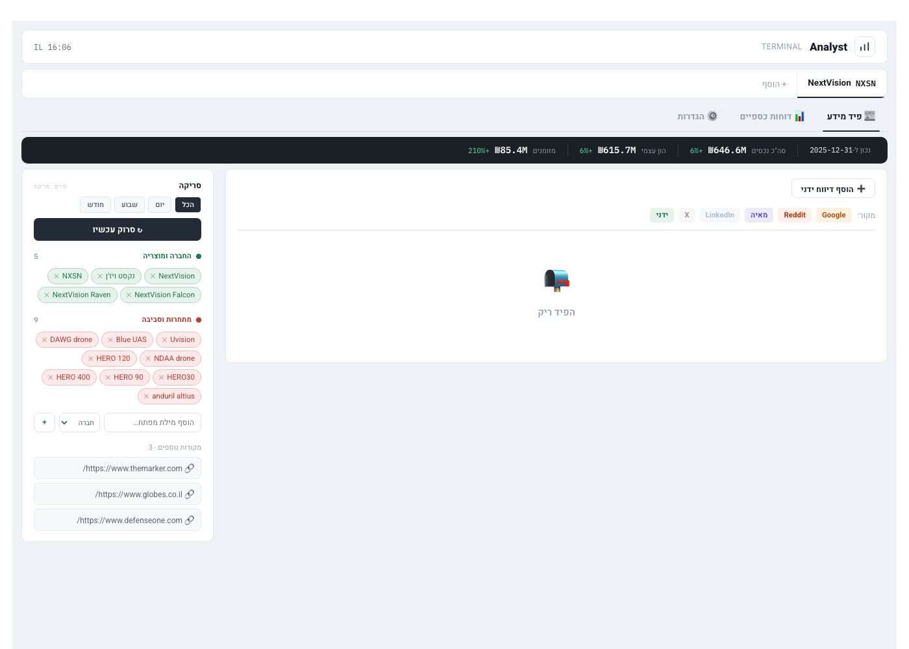
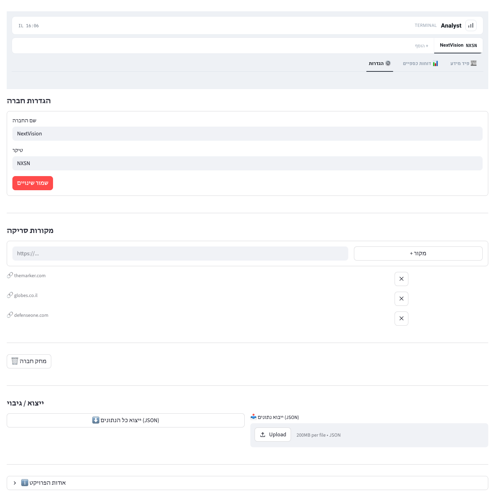

# 📊 Analyst Terminal

A research terminal for equity analysts to track public companies: a multi-source
news/intel feed, editable financial statement tables, and LLM-powered financial
PDF extraction — built end-to-end with Streamlit and the Claude API.

This is a personal portfolio project. It isn't affiliated with any employer, and
the sample data (NextVision / NXSN) is a demo dataset built from that company's
own public TASE/Maya filings, used only to showcase the tool.



## Why I built this

I wanted a single project that could demonstrate full-stack product thinking
end to end, not just a script: real data ingestion, an LLM in the data
pipeline (not just a chatbot), a UI built to look like a real analyst tool
rather than a default Streamlit form, and enough attention to correctness
(tests, duplicate/conflict detection, validation) to be trustworthy with
real financial figures.

## What it does

- **LLM-powered financial extraction.** Upload a balance-sheet PDF (e.g. a
  Maya/TASE filing) and Claude reads it and maps it into ~30 structured
  fields — cash, receivables, liabilities, equity, etc. — with automatic
  balance-check validation and duplicate/conflict detection so a
  re-upload never silently overwrites a different figure.
- **Multi-source intelligence feed.** Aggregates Google News, Reddit, and
  custom RSS/site sources per company, auto-classifies each item as
  "company" vs. "competitor" by keyword, and supports manual entries too.
- **Editable financial tables + Excel export.** Financial statements are
  editable in the UI and export to an Excel workbook formatted the way an
  analyst's own spreadsheet is laid out (RTL, grouped sections, totals).
- **A custom RTL rendering engine.** Streamlit's own CSS can't produce a
  polished, fully right-to-left financial UI, so each tab is rendered as
  an isolated HTML document inside an iframe (`streamlit_theme/render.py`),
  with query-param-driven navigation shimmed back into Streamlit's rerun
  cycle — full design control without fighting the framework.
- **JSON backup/restore** of the full dataset, for portability.



## Tech stack

- **[Streamlit](https://streamlit.io)** — app shell, forms, file I/O
- **Custom HTML/CSS iframe layer** — the actual UI (`streamlit_theme/`)
- **[Claude API](https://www.anthropic.com)** (`claude-opus-4-8`) — PDF → structured
  balance-sheet extraction
- **pdfplumber** — PDF text extraction feeding the Claude prompt
- **pandas / openpyxl** — financial table modeling + Excel export
- **feedparser / requests** — Google News, Reddit, and custom RSS ingestion
- **pytest** — extraction correctness, validation, and dedup/conflict tests

## Running locally

```bash
pip install -r requirements.txt
```

Add your Claude API key to `.streamlit/secrets.toml` (gitignored, never
committed):

```toml
ANTHROPIC_API_KEY = "sk-ant-..."
```

```bash
streamlit run app.py
```

## Project structure

```
├── app.py                        # main Streamlit entrypoint
├── requirements.txt
├── streamlit_theme/
│   └── render.py                 # the actual UI — HTML rendered into an iframe
├── data/
│   └── default_data.json         # seed/demo data
├── utils/
│   ├── data_manager.py           # CRUD + persistence + feed ingestion
│   ├── pdf_extractor.py          # Claude-powered PDF → balance sheet
│   └── build_balance_sheet.py    # table assembly + Excel export
└── tests/
    └── test_balance_sheet_extraction.py
```

## Deploying to Streamlit Cloud

1. Push to GitHub
2. Go to [share.streamlit.io](https://share.streamlit.io)
3. Connect the repo, set `app.py` as the entrypoint
4. Add `ANTHROPIC_API_KEY` under app secrets
5. Deploy

---

## פיצ'רים (עברית)

- **טאב לכל חברה** עם פיד מידע, מילות מפתח ודוחות כספיים
- **פיד מידע** מ-Google, Reddit, מאיה, ומקורות מותאמים אישית
- **חילוץ דוחות כספיים מ-PDF עם Claude**, כולל בדיקת תקינות ואיתור כפילויות
- **טבלת דוחות כספיים** ניתנת לעריכה, עם ייצוא לאקסל בפורמט אנליסט
- **גיבוי/ייבוא** של כל הנתונים כ-JSON
